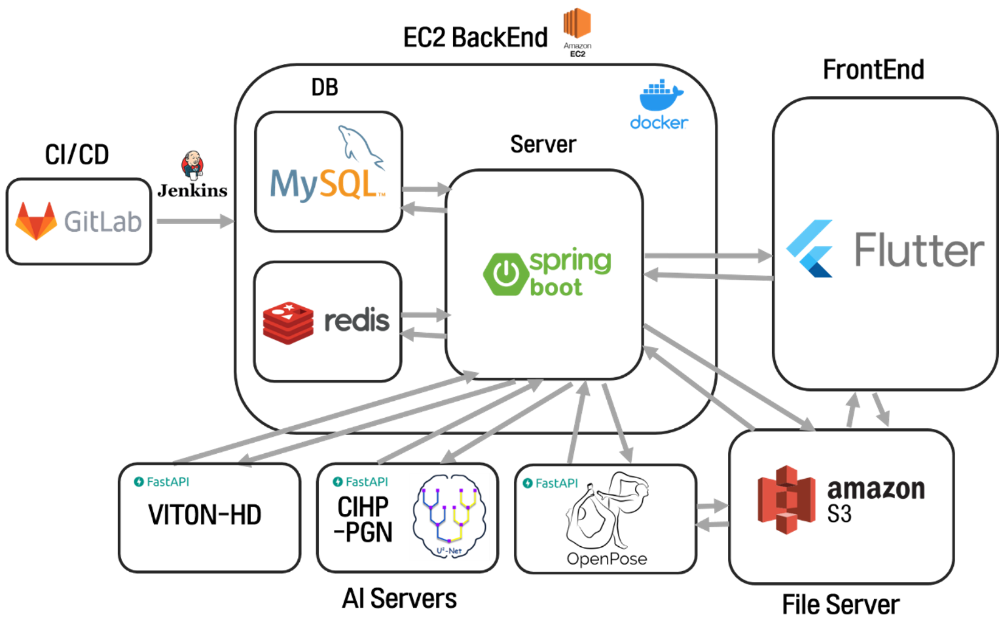
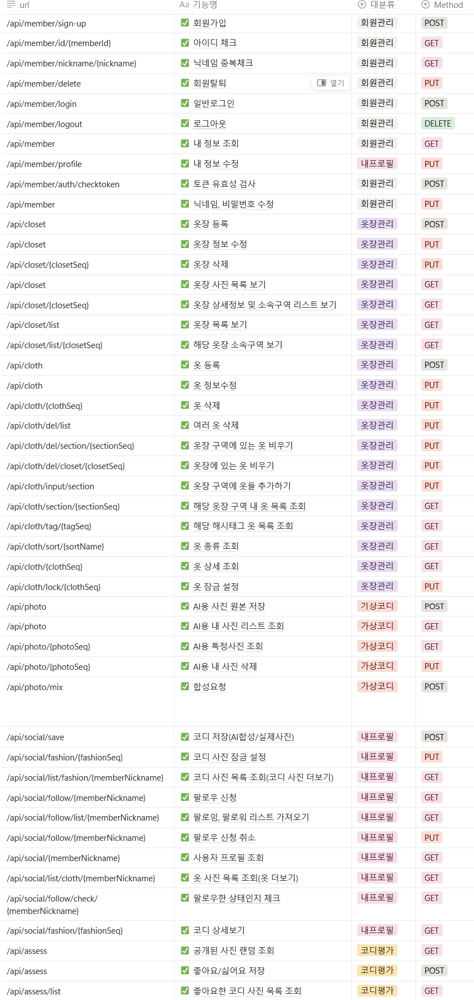
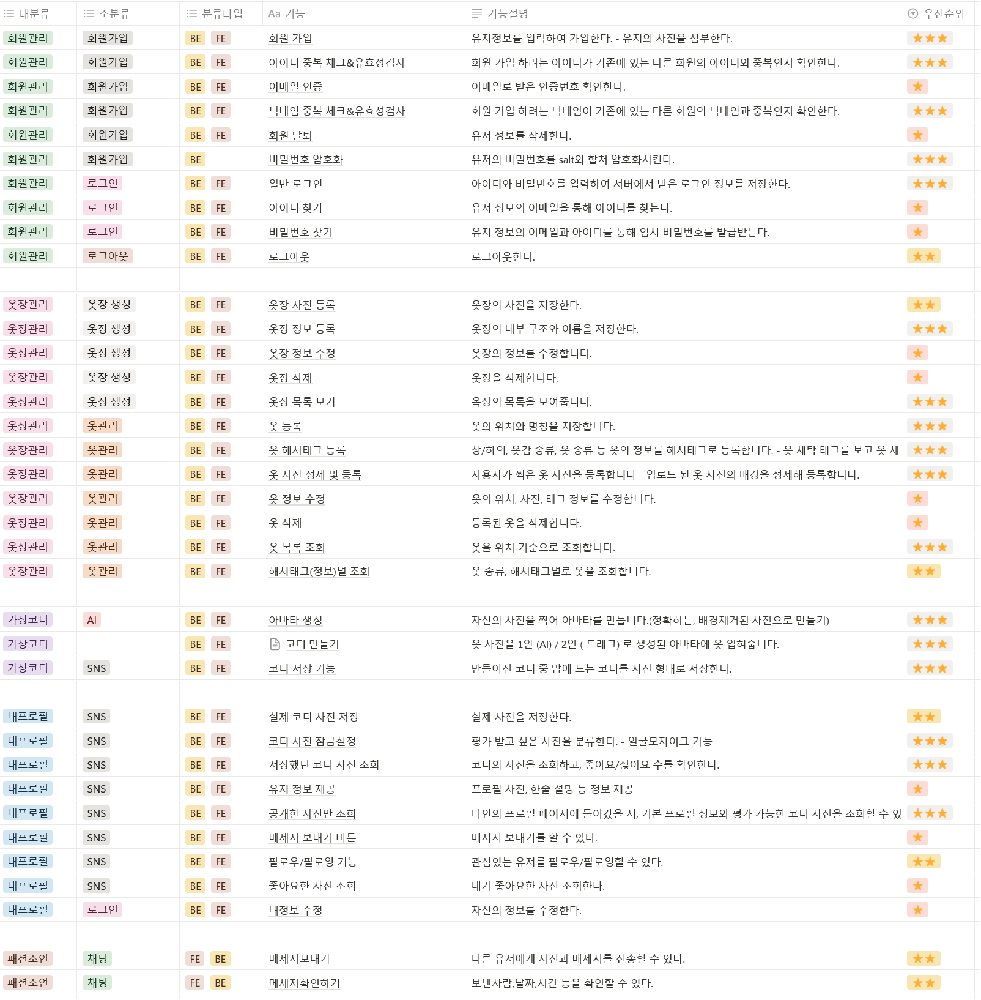

# 프로젝트 개요

## 프로젝트 기간
2023.10.09 ~ 2023.11.17 (6주)
## 참여인원
총원 6인
## 사용 기술 스택
- FE: Flutter
- BE: Spring Boot, FastAPI
- DB: MySQL, Redis
## 기획의도
사용자의 옷 관리를 돕고, 가상 시착으로 생성되었거나 직접 찍은 사진을 다른 사용자들에게 평가받아 자신의 패션의 좋고 나쁨을 알아볼 수 있는 서비스
## 프로젝트 특징
1. 사용자가 자신의 옷장을 등록하여, 옷장에 구획을 자유롭게 추가/삭제 가능
2. 사용자가 옷을 등록하여 관리할 수 있게 됨
3. 사용자가 등록한 옷들을 위치별, 태그별, 종류별 조회가 가능
4. 사용자가 자신의 사진과 자신의 옷을 합성하여 가상 시착을 할 수 있음
5. 사용자가 공개한 패션을 다른 사용자에게 평가를 받아볼 수 있음

# 아키텍쳐

# 서비스 기능
exec 폴더의 시연 시나리오 참고

# API 명세서

# 기능 명세서
